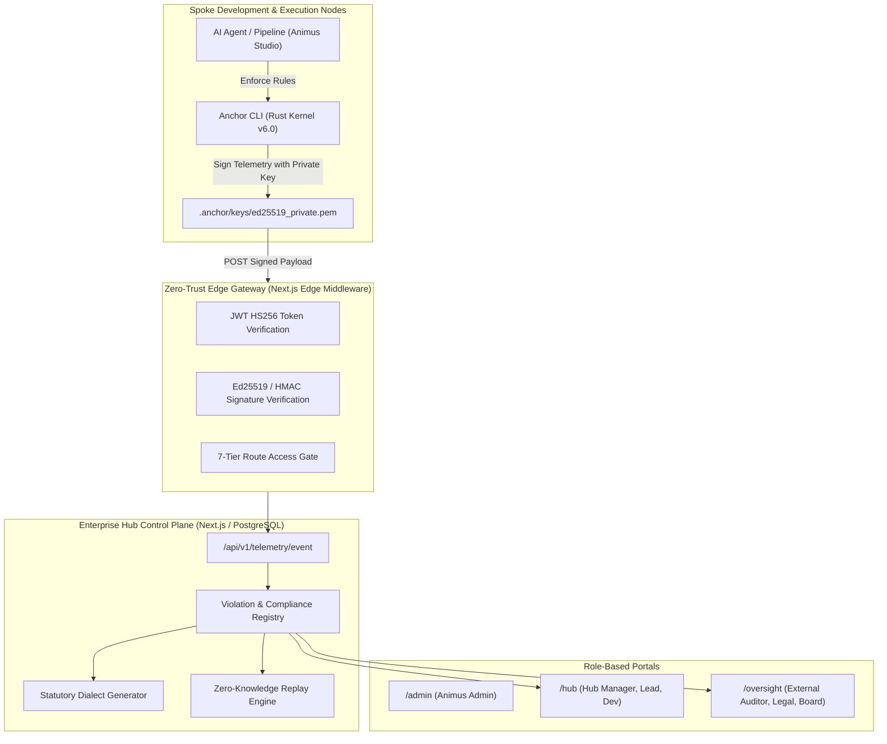

# Anchor Institutional System Architecture & Handover Specification
**Authoritative Architectural Specification & Operational Handover Document**  
**Classification:** Enterprise AI Governance Infrastructure (Restricted / Institutional)  
**Version:** 6.0.2-LTS  
**Author:** AnimusLab System Kernel Architecture Team  

---

## Table of Contents
1. [Executive Summary & System Invariants](#1-executive-summary--system-invariants)
2. [End-to-End System Topology](#2-end-to-end-system-topology)
3. [The 7-Tier Institutional RBAC Matrix & Edge Enforcement](#3-the-7-tier-institutional-rbac-matrix--edge-enforcement)
4. [Ed25519 Asymmetric Node Cryptography & Signed Telemetry Protocol](#4-ed25519-asymmetric-node-cryptography--signed-telemetry-protocol)
5. [Zero-Knowledge Replay (Article VII) Sanitization Architecture](#5-zero-knowledge-replay-article-vii-sanitization-architecture)
6. [Multi-Tenant Hub Siloing & Scoped API Key Governance](#6-multi-tenant-hub-siloing--scoped-api-key-governance)
7. [Sub-Millisecond Rust Core Static Analyzer & Auto-Healer Engine](#7-sub-millisecond-rust-core-static-analyzer--auto-healer-engine)
8. [Statutory Dialect Translation Matrix (EU AI Act, RBI, SEC, FINOS)](#8-statutory-dialect-translation-matrix-eu-ai-act-rbi-sec-finos)
9. [Operational Runbooks & Key Rotation Procedures](#9-operational-runbooks--key-rotation-procedures)

---

## 1. Executive Summary & System Invariants

Anchor is an institutional-grade federated governance and audit infrastructure designed to enforce deterministic safety, statutory compliance, and behavioral integrity across enterprise AI systems and autonomous agent swarms.

### Core System Invariants
- **Cryptographic Non-Repudiation:** Every code audit, violation stream, and runtime agent checkpoint is signed using asymmetric Ed25519 keypairs or HMAC-SHA256 DAC chains.
- **Zero-Trust Edge Enforcement:** Every inbound request is cryptographically validated at the edge middleware via strictly verified `HS256` signed JWT session tokens and explicit RBAC route gates.
- **Tenant Isolation:** All Hub resources, API keys, personnel whitelists, and violation logs are strictly scoped to verified tenant Hub IDs (`hubId`), preventing cross-organization horizontal privilege escalation.
- **Zero-Knowledge Forensics:** Raw payload inputs, proprietary code strings, and sensitive PII are scrubbed and anonymized before forensic replay or dialect report export in compliance with Article VII.

---

## 2. End-to-End System Topology



---

## 3. The 7-Tier Institutional RBAC Matrix & Edge Enforcement

Anchor defines seven strictly segregated role tiers with granular permission boundaries:

| Tier | Role Identifier | Target Audience | Primary Permissions & Route Scopes |
| :--- | :--- | :--- | :--- |
| **0** | `ANIMUS_ADMIN` | Platform Operators & Root SecOps | Global tenant provisioning, system-wide whitelist approval, root auditor delegation (`/admin/*`, `/api/v1/whitelist/*`) |
| **1** | `HUB_MANAGER` | Enterprise SecOps Directors / CTO | Hub administration, API key rotation, personnel whitelisting, hub-wide violation triaging (`/hub/settings`, `/api/v1/hub/*`) |
| **2** | `LEAD_ENGINEER` | Team Leads & Engineering Managers | Project-level rule tuning, exception requesting, compliance report sign-off (`/hub/projects`, `/hub/reports`) |
| **3** | `DEVELOPER` | Software & AI Engineers | Local code healing, signed check runs, pull request validation (`/hub/violations`, `anchor check`, `anchor heal`) |
| **4** | `AUDITOR_EXTERNAL` | Regulatory Inspectors & Big-4 Auditors | Read-only forensic review, statutory dialect exports, zero-knowledge replay verification (`/oversight/*`) |
| **5** | `LEGAL_COUNSEL` | Corporate Legal & Compliance Officers | Regulatory matrix alignment, liability exposure modeling, statutory certifier sign-off (`/oversight/dialects`) |
| **6** | `BOARD_OBSERVER` | Executive Board & Governance Committee | High-level risk scorecards, audit sign-off summaries, macro-governance tracking (`/oversight/summary`) |

### Edge Middleware Enforcement Engine (`middleware.ts`)
Edge enforcement performs cryptographic verification using `jose.jwtVerify()` pinned to `HS256` using the securely held `SESSION_SECRET`. Unsigned session cookies or modified role claims are rejected before route execution.

---

## 4. Ed25519 Asymmetric Node Cryptography & Signed Telemetry Protocol

Every Spoke node executing Anchor operates with an independent Ed25519 cryptographic identity stored in `.anchor/keys/`:
- `ed25519_private.pem`: 32-byte Ed25519 seed / private key (never leaves local host).
- `ed25519_public.pem`: DER/PEM-encoded public key registered with the Hub.
- `fingerprint`: SHA-256 digest of the public key string.

### Telemetry Packet Verification Protocol (`/api/v1/telemetry/event`)
1. **Payload Serialization:** Spoke canonicalizes telemetry JSON (`json.dumps(payload, separators=(',', ':'))`).
2. **Asymmetric Signing:** Spoke signs the canonical byte buffer using its Ed25519 private key:
   $$\text{Signature} = \text{Ed25519Sign}(\text{PrivateKey}, \text{Bytes}(\text{Payload}))$$
3. **Transmission:** Packet is dispatched with headers:
   - `X-Anchor-Signature: <base64_signature>`
   - `X-Anchor-Fingerprint: sha256:<fingerprint>`
   - `X-Anchor-Timestamp: <iso_utc_string>`
4. **Hub Verification:** The Hub loads the registered public key matching the fingerprint and executes:
   $$\text{Valid} = \text{Ed25519Verify}(\text{PublicKey}, \text{Bytes}(\text{RawBody}), \text{Signature})$$
5. **Anti-Replay Protection:** Telemetry timestamp is verified against server time within an acceptable window ($\pm 300\text{s}$).

---

## 5. Zero-Knowledge Replay (Article VII) Sanitization Architecture

To allow external regulators and forensic auditors to reconstruct and verify AI safety incidents without leaking proprietary IP or sensitive data, Anchor implements Article VII Zero-Knowledge Replay Sanitization:

1. **Deterministic Redaction:** Sensitive variables, API bearer tokens, and file system user paths are replaced with deterministic surrogate tokens (e.g., `[REDACTED_SECRET_ID_#]`).
2. **Context Window Masking:** Proprietary prompt context and client embeddings are transformed into topological invariant embeddings.
3. **Cryptographic Witness Generation:** The raw incident hash is linked to the sanitized replay hash using a SHA-256 Merkle root, proving the audit trail was not forged post-hoc.

---

## 6. Multi-Tenant Hub Siloing & Scoped API Key Governance

Every enterprise tenant is partitioned into an isolated Hub container:
- **Tenant ID Isolation:** All SQL queries on `violations`, `api_keys`, `users`, and `reports` explicitly filter by `WHERE hub_id = :session_hub_id`.
- **Scoped API Keys:** Node API keys (`ak_live_...`) are cryptographically hashed using SHA-256 and bound to a specific `hub_id` and permission mask (`telemetry:write`, `violations:read`).
- **IDOR Protection:** All mutating endpoints (`DELETE /api/v1/hub/keys`, `POST /api/v1/hub/personnel/whitelist`) verify ownership between the target entity's `hubId` and the authenticated caller's `session.hubId`.

---

## 7. Sub-Millisecond Rust Core Static Analyzer & Auto-Healer Engine

Anchor's static analysis kernel is implemented in Rust (`anchor_core_rs`) utilizing zero-copy memory-mapped file traversal (`memmap2`) and multi-threaded parallel execution (`rayon`):
- **Performance:** Scans 15,000+ lines of code across 130+ files in under **80 milliseconds** ($\approx 5\mu\text{s}$ per file).
- **Domain Coverage:** 9 core governance domains (SEC, ETH, PRV, ALN, AGT, LEG, OPS, SUP, SHR).
- **Auto-Healer Engine (`anchor heal`):**
  - Synthesizes rule-specific AST transformations.
  - Generates unified diffs and in-place patches.
  - Automatically isolates and sandboxes unsanitized subprocess executions (`SEC-007`), credential leaks (`SEC-002`), and unmoderated model generation endpoints (`ALN-001`).

---

## 8. Statutory Dialect Translation Matrix

Anchor automatically cross-compiles low-level static analysis findings into statutory compliance matrices across primary global jurisdictions:

| Statute / Regulation | Statutory Mandate | Mapped Anchor Rule ID | Verification Mechanism |
| :--- | :--- | :--- | :--- |
| **EU AI Act Art. 14** | Human Oversight & Intervention | `AGT-001` / `EU-ART14` | Execution gate verification & confirmation hooks |
| **EU AI Act Art. 50** | Synthetic Media AI Transparency | `AGT-001` / `EU-ART50` | Machine-readable provenance and watermarking checks |
| **EU AI Act Art. 12/19** | Tamper-Evident Audit Logging | `RBI-007` / `EU-ART12` | Immutable DAC log stream & 6-month retention verification |
| **RBI Master Directions** | Unsandboxed Script Execution & Key Exposure | `SEC-007`, `SEC-002` | Subprocess sandboxing & credential hygiene gating |
| **SEC Reg SCI / 15c3-5** | Uncontrolled Algorithmic Loops & Pre-Trade Risk | `SEC-REG-SCI`, `SEC-RULE-15C3` | Unbounded loop detection & financial threshold verification |
| **FINRA Rule 3110** | Algorithmic Supervision & Tamper-Evident Ledgers | `SEC-FINRA-3110` | Ed25519 cryptographic signature chains on trading decisions |

---

## 9. Operational Runbooks & Key Rotation Procedures

### Spoke Node Initialization
```bash
# Initialize Anchor in a local repository
python -m anchor init --all --no-prompt

# Run static compliance check
python -m anchor check . --format human

# Auto-remediate detected violations
python -m anchor heal --apply
```

### Node Key Rotation Runbook
1. Generate new Ed25519 keypair: `anchor keygen --rotate`
2. Export public identity: `anchor identity export > public_identity.json`
3. Submit public key rotation request to Enterprise Hub Manager for approval.
4. Once approved in `/hub/settings/keys`, old key fingerprint is archived to the historical verification ring.

### Hub Service Health Check
```bash
# Verify database connection and schema migrations
npx prisma migrate status

# Run institutional security & integrity test suite
node scratch/verify_all_patches.mjs
```

---
**Institutional Verification Sign-Off:**  
🛡️ **Certified by AnimusLab System Kernel Architecture Team**  
*Immutable Architecture Baseline Locked & Authenticated.*
