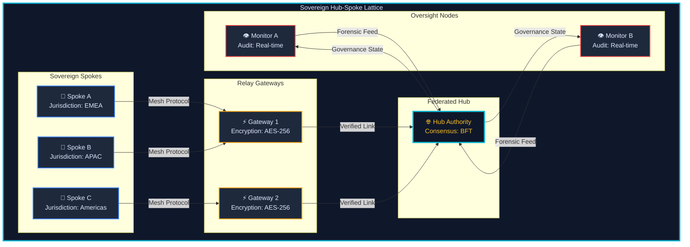
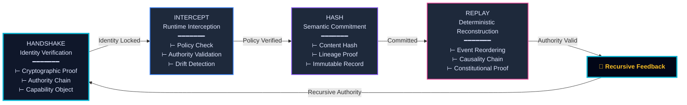
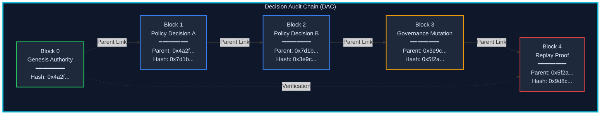
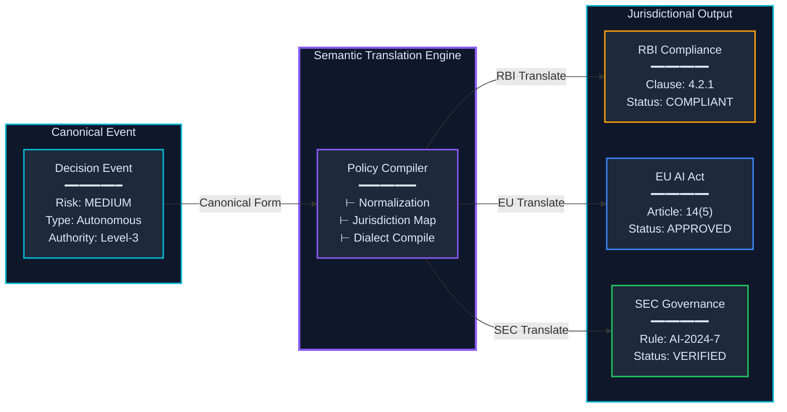
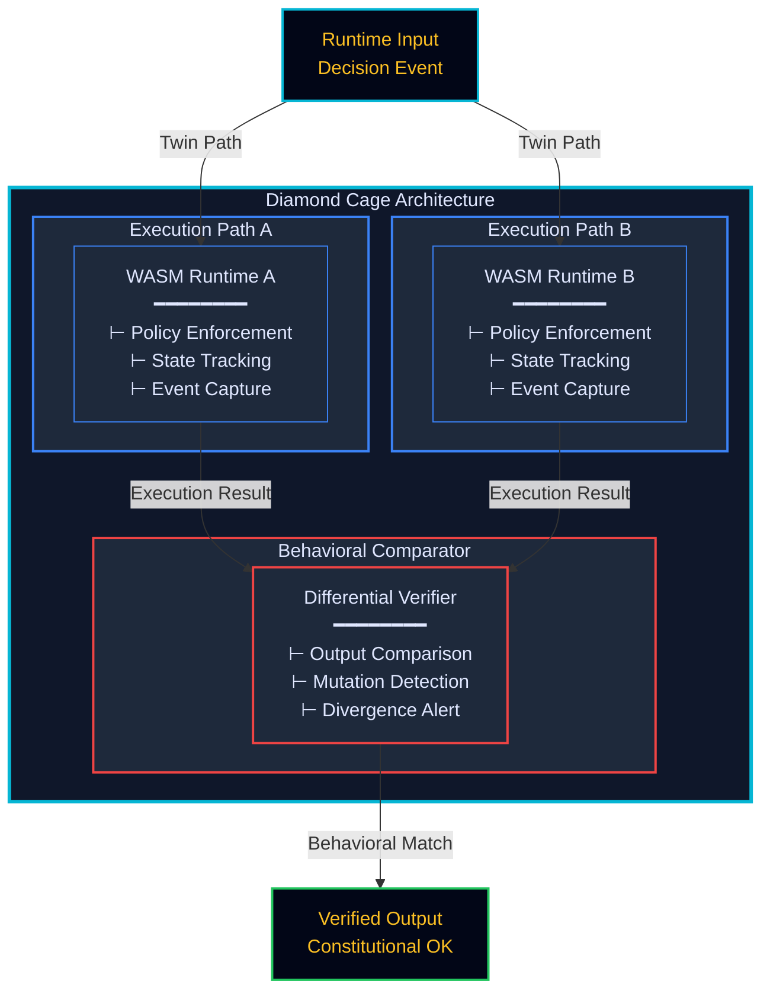

# Anchor v5.0.4 - Complete Mermaid Diagram Suite

Six institutional-grade diagrams for governance architecture (NATO/DoD aesthetic).

---

## DIAGRAM I: The Sovereign Hub-Spoke Lattice
**Section:** IV | **Theme:** Federated topology architecture



---

## DIAGRAM II: Four-Verb Constitutional Execution Cycle
**Section:** V | **Theme:** HANDSHAKE → INTERCEPT → HASH → REPLAY recursive loop



---

## DIAGRAM III: Decision Audit Chain (DAC)
**Section:** VIII | **Theme:** Parent-linked governance lineage with semantic hashing



---

## DIAGRAM IV: Cross-Jurisdiction Constitutional Translation
**Section:** XI | **Theme:** Semantic equivalence engine bridging regulatory dialects



---

## DIAGRAM V: Diamond Cage Differential Verification
**Section:** XIII | **Theme:** Twin WASM execution paths with behavioral comparison



---

## DIAGRAM VI: Institutional Identity Subtype Gating
**Section:** XVI | **Theme:** Context filters and capability manifest compilation

```mermaid
graph TB
    subgraph Gate ["Governance Identity Gating"]
        subgraph Request ["Authorization Request"]
            R["Identity Token<br/>━━━━━━━━<br/>User: aud_001<br/>Scope: cross_hub<br/>Jurisdiction: IN"]
        end
        
        subgraph Filters ["Context Filters"]
            F1["Scope Validator<br/>━━━━━━<br/>✓ cross_hub"]
            F2["Jurisdiction Check<br/>━━━━━━<br/>✓ RBI Approved"]
            F3["Capability Audit<br/>━━━━━━<br/>✓ Export Auth"]
        end
        
        subgraph Manifest ["Capability Manifest"]
            M1["Visibility: ORG_WIDE"]
            M2["Replay: RESTRICTED"]
            M3["Forensic: DENIED"]
        end
        
        subgraph Grant ["Access Grant"]
            G["Signed Capability Token<br/>━━━━━━━<br/>Exp: +24h<br/>Nonce: 0x7f2a..."]
        end
    end
    
    R -->|Pass| F1
    F1 -->|Validate| F2
    F2 -->|Verify| F3
    F3 -->|Compile| M1
    F3 -->|Compile| M2
    F3 -->|Compile| M3
    M1 -->|Token| G
    M2 -->|Token| G
    M3 -->|Token| G
    
    style Gate fill:#0f172a,stroke:#06b6d4,stroke-width:3px,color:#e0e7ff
    style Request fill:#1e293b,stroke:#06b6d4,stroke-width:2px,color:#e0e7ff
    style R fill:#1e293b,stroke:#06b6d4,stroke-width:1px,color:#e0e7ff
    style Filters fill:#1e293b,stroke:#8b5cf6,stroke-width:2px,color:#e0e7ff
    style F1 fill:#1e293b,stroke:#3b82f6,stroke-width:1px,color:#e0e7ff
    style F2 fill:#1e293b,stroke:#3b82f6,stroke-width:1px,color:#e0e7ff
    style F3 fill:#1e293b,stroke:#3b82f6,stroke-width:1px,color:#e0e7ff
    style Manifest fill:#1e293b,stroke:#22c55e,stroke-width:2px,color:#e0e7ff
    style M1 fill:#1e293b,stroke:#22c55e,stroke-width:1px,color:#e0e7ff
    style M2 fill:#1e293b,stroke:#22c55e,stroke-width:1px,color:#e0e7ff
    style M3 fill:#1e293b,stroke:#22c55e,stroke-width:1px,color:#e0e7ff
    style Grant fill:#1e293b,stroke:#f59e0b,stroke-width:2px,color:#e0e7ff
    style G fill:#1e293b,stroke:#f59e0b,stroke-width:1px,color:#e0e7ff
```



---

## Design Specifications

| Element | Value | Hex Code |
|---------|-------|----------|
| **Background** | Dark Navy | `#0f172a` |
| **Deep Background** | Darker Navy | `#020617` |
| **Midtone** | Slate-800 | `#1e293b` |
| **Primary Accent** | Cyan (Anchor) | `#06b6d4` |
| **Secondary** | Blue | `#3b82f6` |
| **Tertiary** | Purple | `#8b5cf6` |
| **Warning** | Amber | `#f59e0b` |
| **Critical** | Red | `#ef4444` |
| **Success** | Green | `#22c55e` |
| **Accent** | Pink | `#ec4899` |
| **Text** | Light Slate | `#e0e7ff` |
| **Highlight** | Amber-300 | `#fbbf24` |

---

## Usage

1. **Live Preview**: Visit [mermaid.live](https://mermaid.live)
2. **Copy & Paste**: Copy each code block above (starting with `graph`)
3. **Markdown**: Wrap with ` ```mermaid` and ` ``` `
4. **PDF Embedding**: Use `mermaid-cli` to convert to SVG/PNG
5. **Documentation**: Add to Anchor governance architecture documentation

### Installation (for local rendering):

```bash
npm install -g @mermaid-js/mermaid-cli
mmdc -i diagram.mmd -o diagram.svg
```

---

## Diagram Placement in PDF

| Diagram | Section | Pages |
|---------|---------|-------|
| I | IV | ~50-60 |
| II | V | ~65-75 |
| III | VIII | ~110-130 |
| IV | XI | ~160-180 |
| V | XIII | ~250-280 |
| VI | XVI | ~350-380 |

---

All diagrams follow **NATO/DoD institutional aesthetic** with high-contrast stroking, dense node structures, and professional governance terminology.
