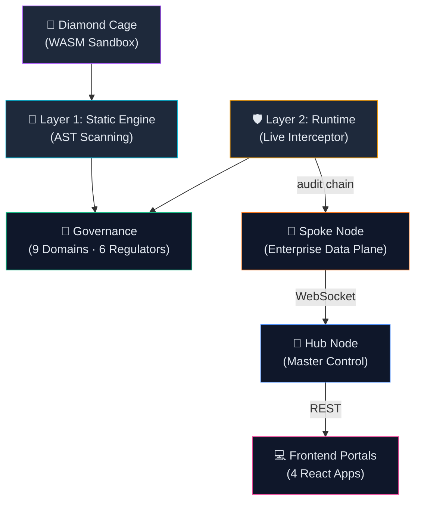
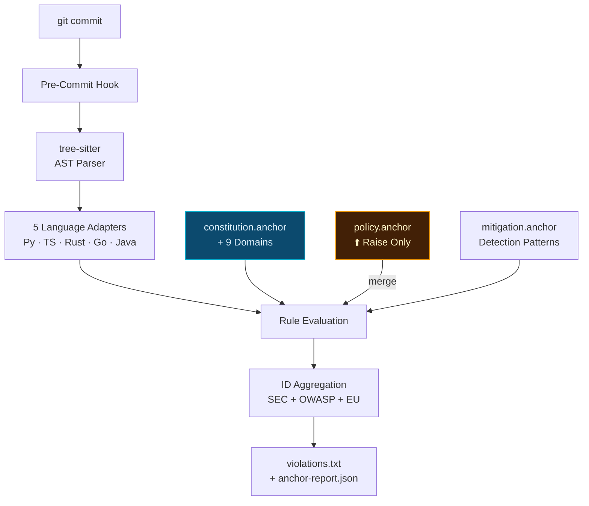
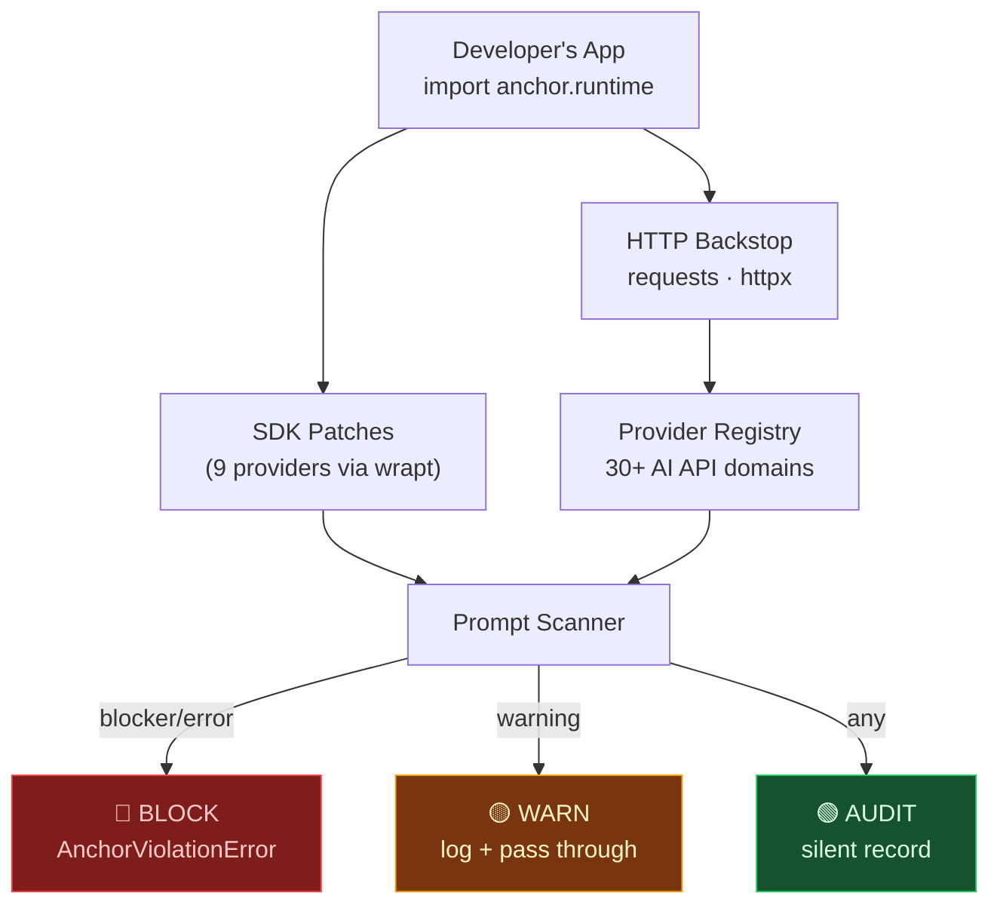
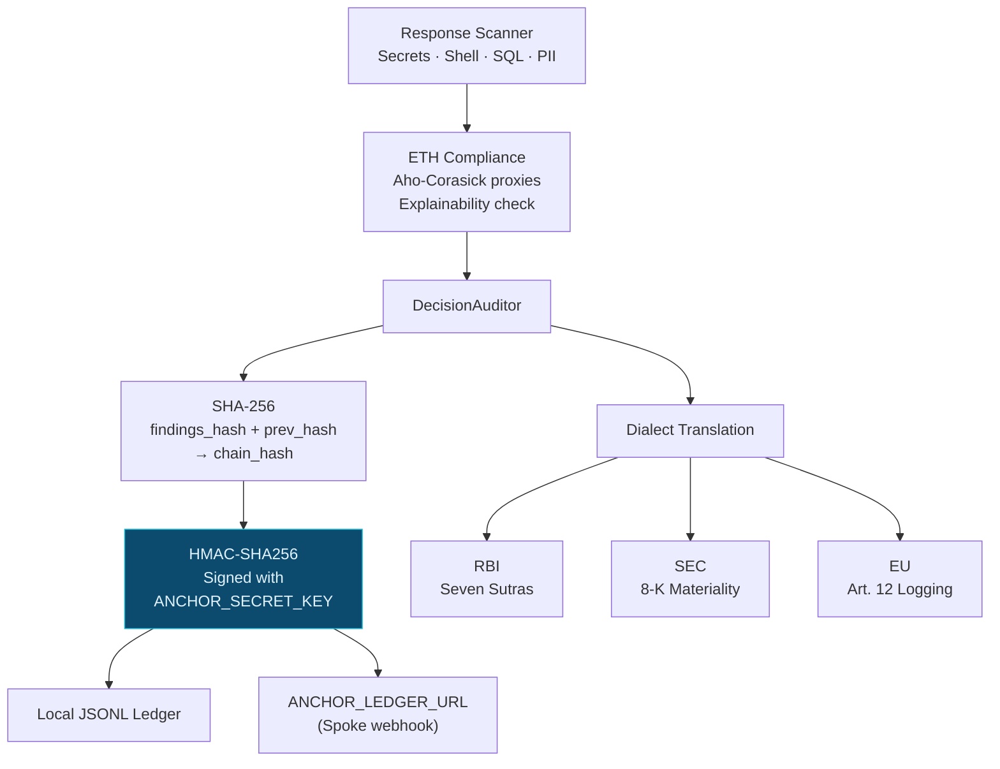
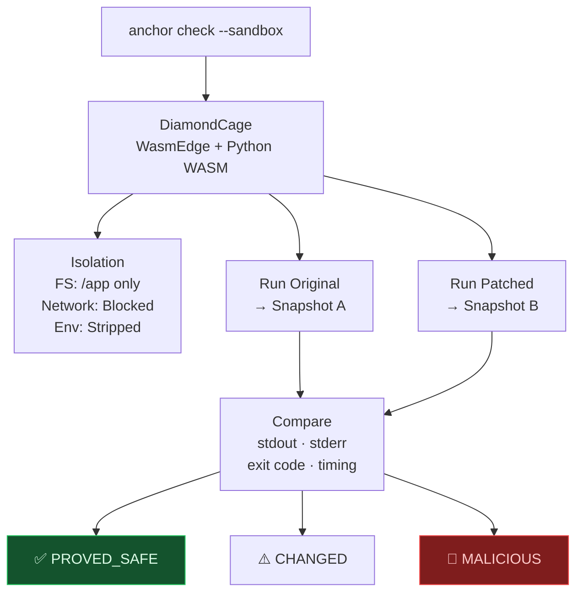
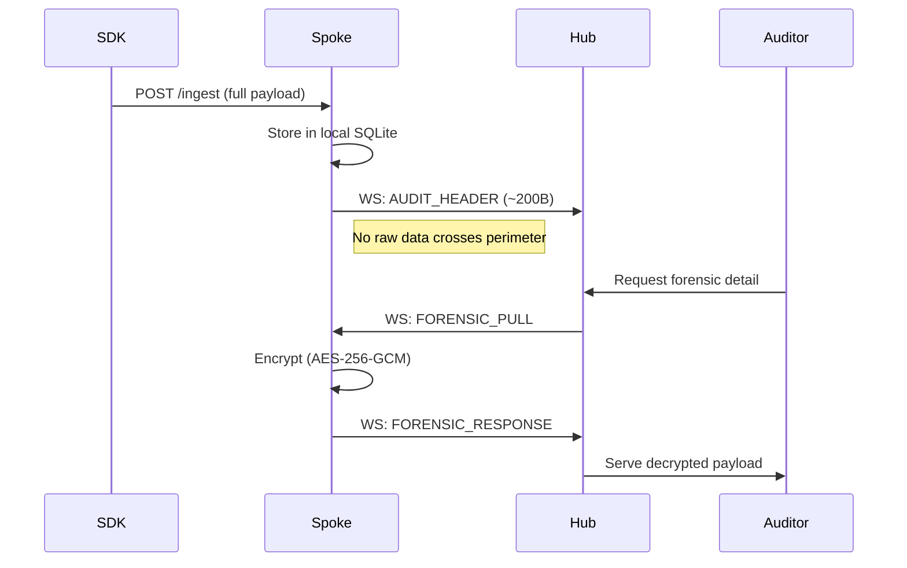
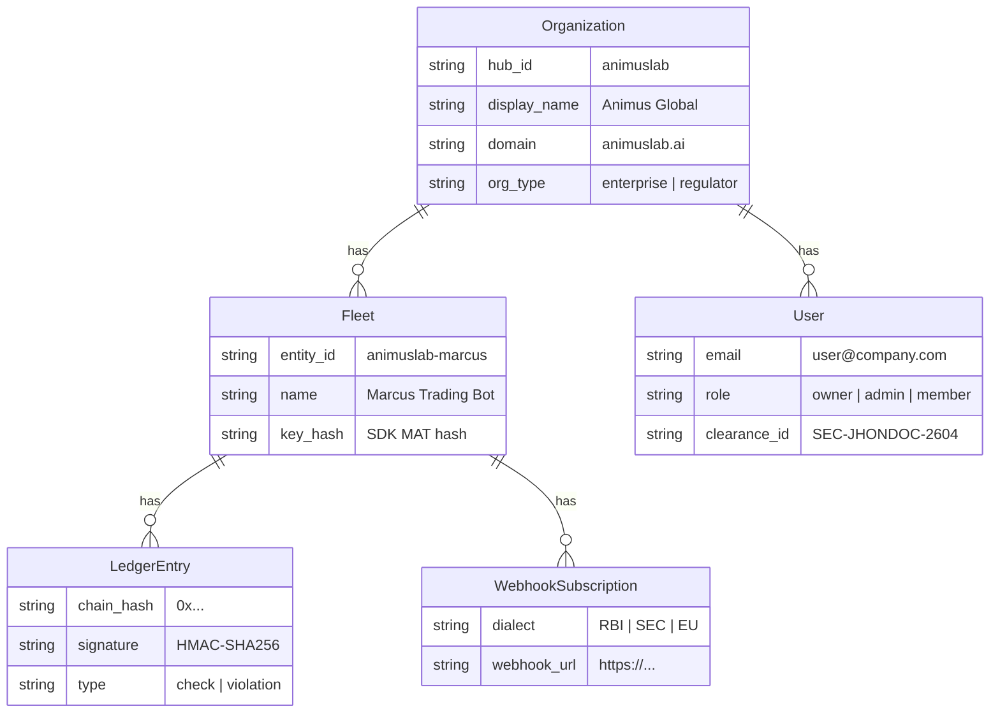
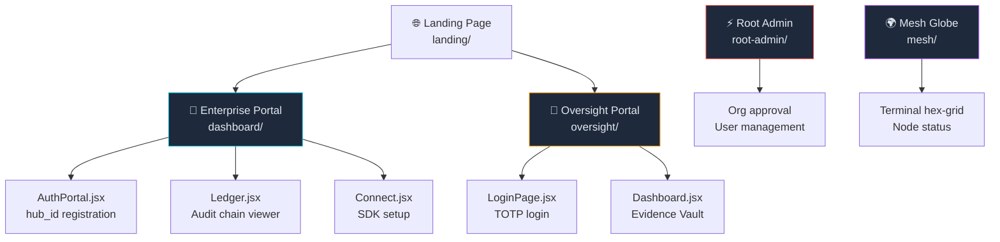
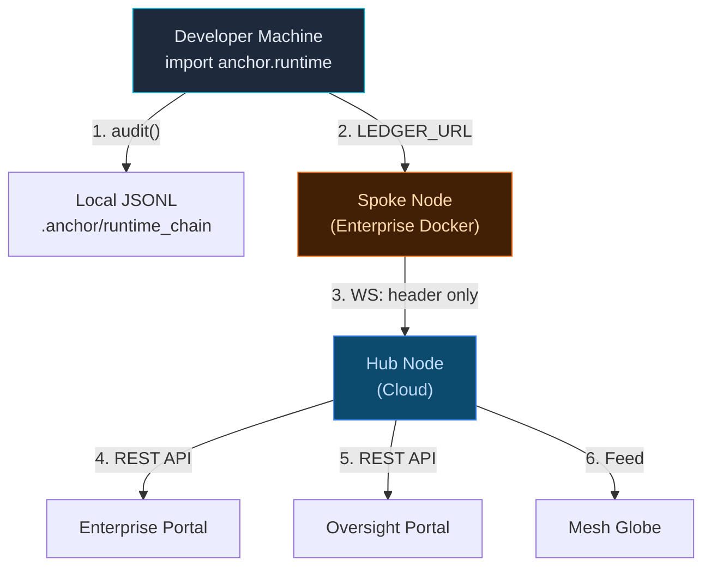

# Anchor — System Architecture

> **`anchor`** = Python governance engine (PyPI)
> **`anchor-web`** = Sovereign Identity Mesh (web platform)

---

## 01. System Overview



---

## 02. Repo: `anchor` (Python Package)

```
anchor/
├── cli.py                       # anchor init / check / heal / sync
├── core/
│   ├── engine.py                # PolicyEngine (AST + regex scan)
│   ├── loader.py                # Federation loader
│   ├── constitution.py          # Remote SHA-256 integrity
│   ├── crypto.py                # HMAC-SHA256 signing
│   ├── sandbox.py               # Diamond Cage (WASM)
│   ├── healer.py                # Auto-fix suggestions
│   ├── verdicts.py              # Architectural drift
│   ├── model_auditor.py         # ML weight auditing
│   └── policy_loader.py         # policy.anchor merge
├── runtime/
│   ├── __init__.py              # activate() / enforce()
│   ├── guard.py                 # AnchorGuard API
│   ├── decision_auditor.py      # Crypto audit chain
│   ├── models.py                # AuditEntry (RBI/SEC/EU dialects)
│   └── interceptors/
│       ├── framework.py         # 9 SDK patches (wrapt)
│       ├── http_backstop.py     # requests/httpx catch-all
│       ├── output_scanner.py    # Response scanner
│       └── provider_registry.py # 30+ AI API domains
├── adapters/                    # tree-sitter (Py/TS/Rust/Go/Java)
├── plugins/                     # safetensors / gguf / huggingface
└── governance/
    ├── constitution.anchor      # Root manifest
    ├── mitigation.anchor        # Detection patterns
    ├── domains/ (9)             # SEC·ETH·PRV·ALN·AGT·LEG·OPS·SUP·SHR
    ├── frameworks/ (3)          # FINOS · OWASP · NIST
    └── government/ (6)          # RBI · EU · SEC · SEBI · CFPB · FCA
```

---

## 03. Repo: `anchor-web` (Sovereign Mesh)

### v6.2 Institutional Identity Infrastructure
Anchor v6.2 pivots from a hierarchical clearance model to a deterministic **Institutional Identity** model. This ensures that governance authority is derived from operational reality rather than "security levels."

| Layer | Component | Purpose |
| :--- | :--- | :--- |
| **Identity Subtype** | `government_auditor`, `standard_auditor` | Defines the institutional persona and baseline capabilities. |
| **Capability Manifest** | `can_replay`, `can_export`, `can_issue_notice` | Explicitly provisioned flags with **audit reasoning** and **temporal expiry**. |
| **Visibility Scope** | `jurisdiction_wide`, `assigned_hubs` | Deterministically filters which entities an auditor can see. |
| **Enforcement Layer** | `require_subtypes()` | Backend gating that ensures institutional authority is valid at the runtime level. |

```python
# v6.2 Structured Capability Manifest
{
  "capability": "can_replay",
  "granted_by": "root_admin",
  "reason": "Regulatory investigation #882",
  "expires_at": "2026-06-01T00:00:00Z"
}
```

```python
# Backend Subtype Gating (v6.2 Enforced Runtime)
@app.post("/api/forensic/request")
async def create_forensic_request(
    current_user: dict = Depends(require_subtypes(["government_auditor", "cross_hub_auditor"]))
):
    ...
```

### File Structure
```
anchor-web/
├── server/
│   ├── proxy.py                 # Hub API & visibility enforcement
│   ├── auth.py                  # Identity provider & capability compiler
│   ├── oversight_auth.py        # Regulator gateway
│   ├── models.py                # Institutional Schema (Identity Subtypes)
│   ├── governance/
│   │   └── registry_engine.py   # Deterministic capability registry
...
```

---

## 04. Layer 1 — Static Engine



> [!NOTE]
> **`policy.anchor`** lets each client add private rules and raise severity thresholds — but can **never lower** the constitutional floor. The governance baseline is absolute. (`enforce_raise_only: true`)

---

## 05. Layer 2 — SDK Interception



**Patched SDKs:** OpenAI · Anthropic · Google Gemini · LangChain · Ollama · Groq · Cohere · Mistral · HuggingFace

> [!IMPORTANT]
> **BLOCK does NOT kill the session.** It raises a catchable `AnchorViolationError` — blocks the specific payload but keeps the application alive. The developer catches the exception and substitutes a safe response.

---

## 06. Layer 2 — Audit Chain



---

## 07. Diamond Cage (WASM Sandbox)



---

## 08. Hub ↔ Spoke — Data Sovereignty



> [!IMPORTANT]
> **Data Sovereignty:** Raw forensic payloads NEVER leave the enterprise perimeter via REST. They only travel over the brokered WebSocket relay, AES-256-GCM encrypted, on auditor demand.

---

## 09. Database Schema



---

## 10. Frontend Portals



---

## How `anchor` ↔ `anchor-web` Connect



| Step | What Happens |
|---|---|
| **1** | `DecisionAuditor.audit()` writes to local JSONL with HMAC chain |
| **2** | Full payload POST'd to enterprise Spoke (`ANCHOR_LEDGER_URL`) |
| **3** | Spoke pushes ~200B `AUDIT_HEADER` to Hub (no raw data) |
| **4** | Enterprise users see compliance scores via Dashboard |
| **5** | Regulators see metadata, can trigger `FORENSIC_PULL` |
| **6** | Mesh globe shows live node status |

---

## Key Principles

| Principle | How |
|---|---|
| **Constitutional Floor** | `policy.anchor` can only RAISE severity, never lower |
| **Federated ID** | SEC-007 → OWASP-LLM-02 → EU-ART-15 via alias chains |
| **Data Sovereignty** | Raw data stays on Spoke. Hub gets metadata only. |
| **Surgical Containment** | `AnchorViolationError` blocks payload, keeps session alive |
| **Multi-Dialect** | One AuditEntry → RBI Sutras / SEC 8-K / EU Art.12 |
| **Zero-Knowledge** | Regulators verify via `chain_hash` without raw access |

---

> *v4.3.5 (engine) · v5.1.1 (mesh) · 2026-04-27*
